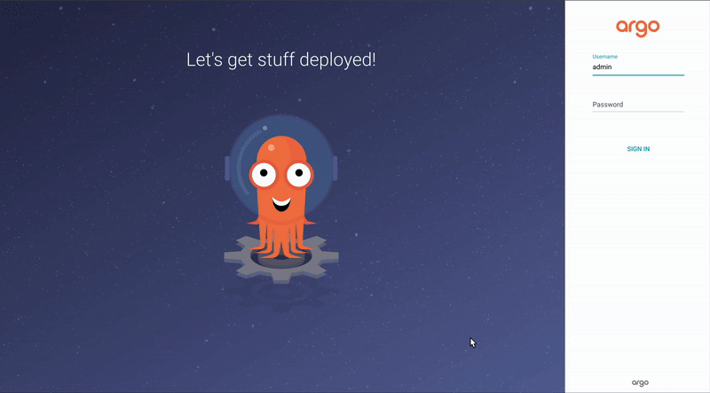

# POC.md  
## Proof of Concept: Deploying ArgoCD on Kubernetes (Kind)

---

### 1. Introduction
This document describes the Proof of Concept (PoC) for deploying **ArgoCD** on the Kubernetes environment chosen during the Concept phase — **Kind (Kubernetes in Docker)**.  
The goal is to demonstrate that ArgoCD can be successfully installed, accessed via its web interface, and used to deploy a sample application.

---

### 2. Environment Setup

**Cluster Creation:**
```bash
kind create cluster --name argocd-poc
kubectl get nodes
```

**Install ArgoCD:**
```bash
kubectl create namespace argocd
kubectl apply -n argocd -f https://raw.githubusercontent.com/argoproj/argo-cd/stable/manifests/install.yaml
kubectl get pods -n argocd
```

---

### 3. Accessing the ArgoCD Web UI

**Port Forward:**
```bash
kubectl port-forward svc/argocd-server -n argocd 8080:443
```
Now the UI is available at:  
➡️ **http://localhost:8080**

**Retrieve the admin password:**
```bash
kubectl -n argocd get secret argocd-initial-admin-secret \
  -o jsonpath="{.data.password}" | base64 -d; echo
```

Log in using:
- **Username:** `admin`
- **Password:** *(from the above command)*

---

### 4. Deploying a Sample Application (Guestbook)

**Apply the Guestbook Application:**
```bash
kubectl apply -f https://raw.githubusercontent.com/argoproj/argocd-example-apps/master/guestbook/guestbook.yaml
```

If file not found — clone repo manually:
```bash
git clone https://github.com/argoproj/argocd-example-apps.git
cd argocd-example-apps/guestbook
kubectl apply -f guestbook.yaml
```

**Check Deployment:**
```bash
kubectl get pods
kubectl get svc
```

---

### 5. Demo Results

| Resource | Status |
|-----------|---------|
| ArgoCD Pods | ✅ Running |
| Guestbook Pods | ✅ Running |
| Web Interface | ✅ Accessible at `localhost:8080` |

**GIF Demo (to be inserted here):**
```markdown

```

---

### 6. Conclusion

ArgoCD was successfully installed and configured on the **Kind** Kubernetes cluster.  
The web interface is accessible, and the Guestbook demo application was deployed automatically via GitOps principles.  
This confirms that the PoC environment is functional and ready for further development toward the MVP phase.
